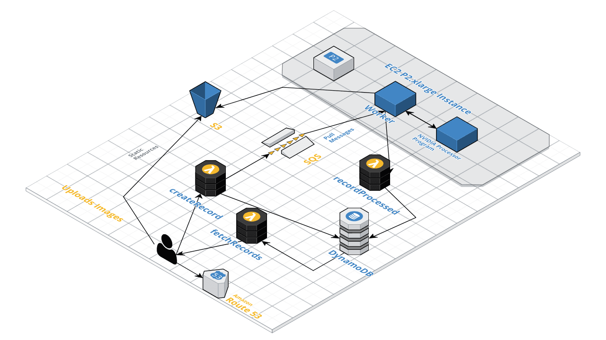

# Styled

This app is based on a serverless AWS infrastructure, the goal is to provide a web UI to style images using Machine Learning (based on: https://github.com/NVIDIA/FastPhotoStyle)

The infrastructure can be seen in the following diagram:

The worker lives in [this repository](https://github.com/Carlows/styled-worker).